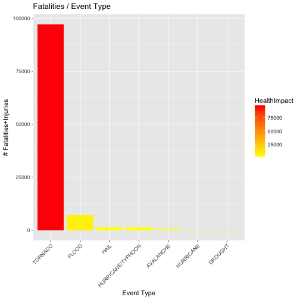

## Synopsis

This report is based on the U.S. National Oceanic and Atmospheric Administration (NOAA) database to assess human and property costs associated with specific weather event types.

In this report I hope to address these questions:

1. Across the United States, which types of events (as indicated in the 𝙴𝚅𝚃𝚈𝙿𝙴 variable) are most harmful with respect to population health?
2. Across the United States, which types of events have the greatest economic consequences?

This data analysis is exploratory and the results can be further fine tuned by curating the dataset.

(This is a report based on my work for Reproducible Research course. Full report can be found here: http://rpubs.com/luisfocosta/256259)


---

(Data analysis withheld)

The event types (7) records) which will be assessed are:


```
##         event_types
## 1           TORNADO
## 2              HAIL
## 3         AVALANCHE
## 4             FLOOD
## 5         HURRICANE
## 6           DROUGHT
## 7 HURRICANE/TYPHOON
```

---

## Results

Which types of events are most harmful with respect to population health?



---

Which types of events have the greatest economic consequences?


